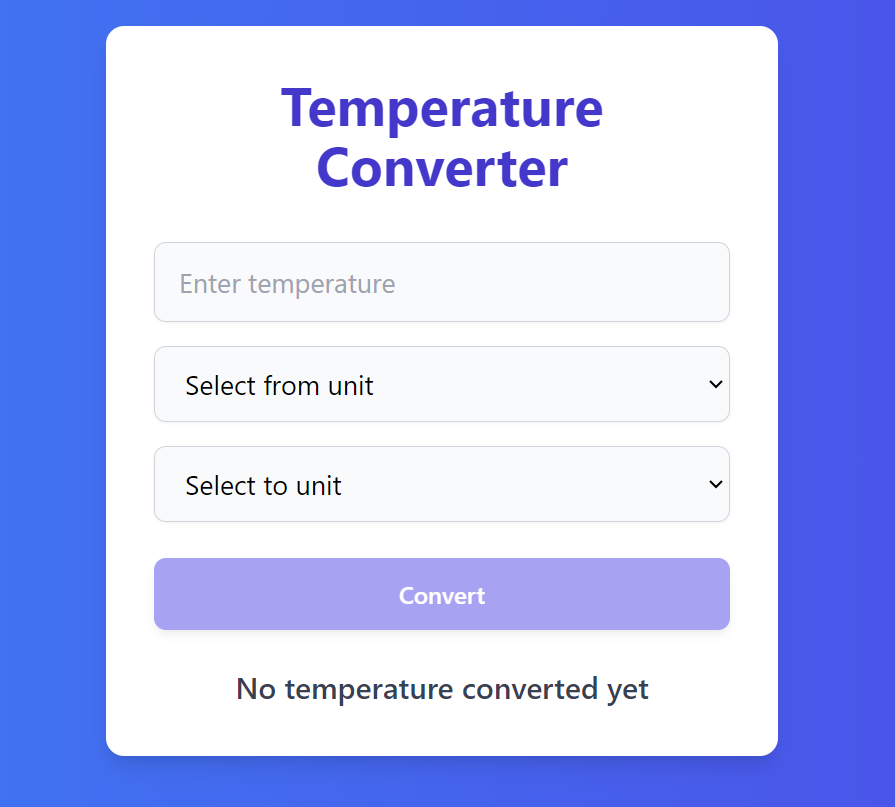
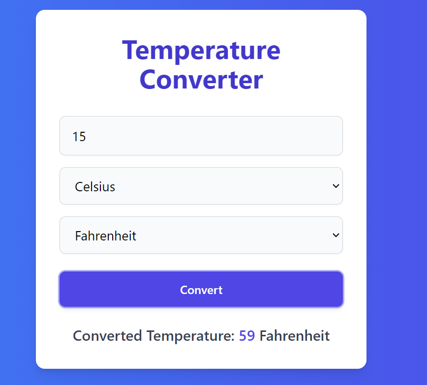
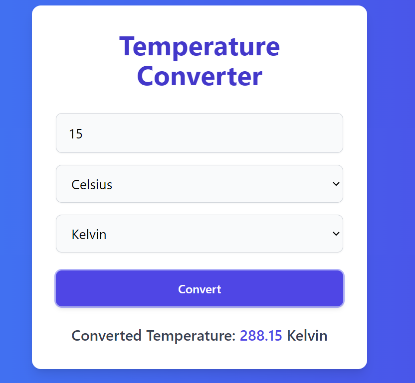
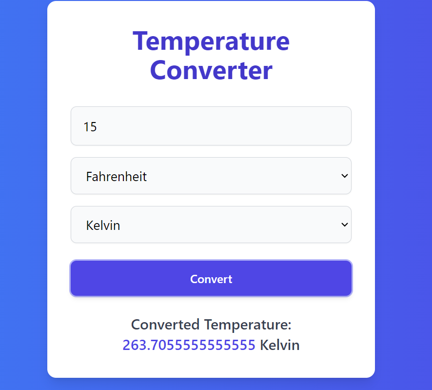
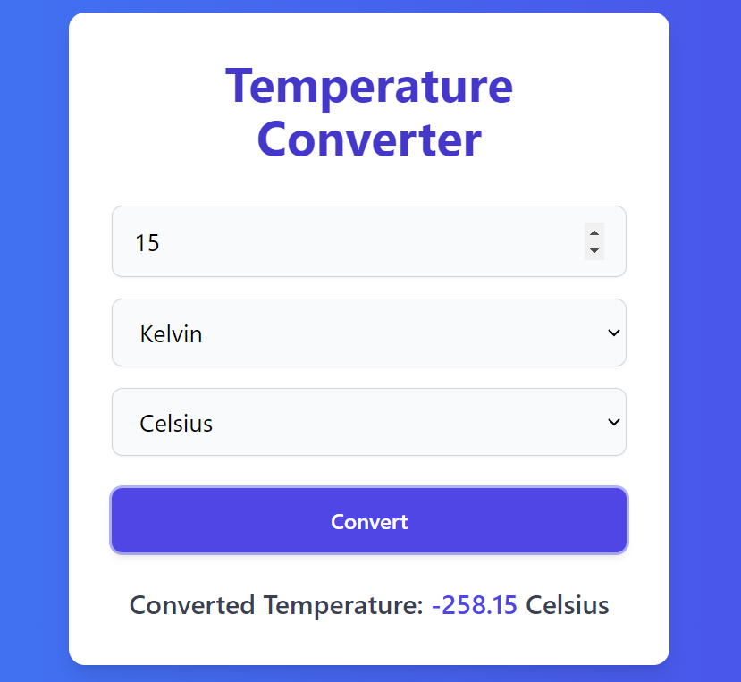

# Temperature Converter Application

## Description
The Temperature Converter Application is a web app built with React and Redux. It allows users to convert temperatures between Celsius, Fahrenheit, and Kelvin. The app uses Redux for state management to handle temperature conversion logic.

## Features
- Convert temperatures between Celsius, Fahrenheit, and Kelvin.
- State management with Redux.
- Responsive design with Tailwind CSS.

## Technologies Used
- **React**: Front-end library for building the user interface.
- **Redux**: State management library.
- **Tailwind CSS**: Utility-first CSS framework for styling.


## Explanation of Redux Slice Code for Temperature Conversion

This code sets up a Redux slice to handle temperature conversions between Celsius, Fahrenheit, and Kelvin. It uses the `@reduxjs/toolkit` library to create a slice of the Redux store for managing temperature conversion state.

### Import Statements

```javascript
import { createSlice } from '@reduxjs/toolkit';
```

- `createSlice` is imported from `@reduxjs/toolkit` to simplify the creation of Redux slices.

### Helper Functions

```javascript
const fahrenheitToCelsius = (temp) => (temp - 32) * 5 / 9;
const kelvinToCelsius = (temp) => temp - 273.15;
const celsiusToFahrenheit = (temp) => (temp * 9 / 5) + 32;
const celsiusToKelvin = (temp) => temp + 273.15;
```

- These functions convert temperatures between different units:
  - `fahrenheitToCelsius`: Converts Fahrenheit to Celsius.
  - `kelvinToCelsius`: Converts Kelvin to Celsius.
  - `celsiusToFahrenheit`: Converts Celsius to Fahrenheit.
  - `celsiusToKelvin`: Converts Celsius to Kelvin.

### Initial State

```javascript
const initialState = {
  temperature: '',
  convertedTemperature: '',
  fromUnit: '',
  toUnit: '',
};
```

- `initialState` defines the initial state of the slice with the following properties:
  - `temperature`: The input temperature value.
  - `convertedTemperature`: The result of the temperature conversion.
  - `fromUnit`: The unit of the input temperature.
  - `toUnit`: The unit to which the temperature should be converted.

### Slice Creation

```javascript
export const tempSlice = createSlice({
  name: 'temp_converter',
  initialState,
  reducers: {
    convertTemperature: (state, action) => {
      const { temperature, fromUnit, toUnit } = action.payload;
      let tempInCelsius;

      switch (fromUnit) {
        case 'Fahrenheit':
          tempInCelsius = fahrenheitToCelsius(temperature);
          break;
        case 'Kelvin':
          tempInCelsius = kelvinToCelsius(temperature);
          break;
        case 'Celsius':
        default:
          tempInCelsius = temperature;
          break;
      }

      switch (toUnit) {
        case 'Fahrenheit':
          state.convertedTemperature = celsiusToFahrenheit(tempInCelsius);
          break;
        case 'Kelvin':
          state.convertedTemperature = celsiusToKelvin(tempInCelsius);
          break;
        case 'Celsius':
        default:
          state.convertedTemperature = tempInCelsius;
          break;
      }

      state.fromUnit = fromUnit;
      state.toUnit = toUnit;
    },
  },
});
```

- `tempSlice` is created using `createSlice` with the following configuration:
  - `name`: The name of the slice, `temp_converter`.
  - `initialState`: The initial state defined earlier.
  - `reducers`: Contains the `convertTemperature` reducer function to handle temperature conversion:
    - It extracts `temperature`, `fromUnit`, and `toUnit` from the `action.payload`.
    - Converts the temperature to Celsius if needed based on `fromUnit`.
    - Converts the Celsius temperature to the desired `toUnit` and updates `state.convertedTemperature`.
    - Updates `state.fromUnit` and `state.toUnit` with the provided units.

### Exports

```javascript
export const { convertTemperature } = tempSlice.actions;
export default tempSlice.reducer;
```

- `convertTemperature` is exported as an action creator.
- The reducer function of the slice is exported as the default export, to be used in the Redux store.

## Explanation of Redux Store Configuration

This code sets up the Redux store using the `@reduxjs/toolkit` library and integrates the temperature conversion slice reducer into the store.

### Import Statements

```javascript
import { configureStore } from '@reduxjs/toolkit';
import tempReducer from './features/tempconverter/tempconverSlice';  // Ensure default import
```

- `configureStore` is imported from `@reduxjs/toolkit` to create and configure the Redux store.
- `tempReducer` is imported from the `tempconverSlice` file, which contains the reducer function for the temperature conversion slice. This import is a default import.

### Store Configuration

```javascript
export const storetemp = configureStore({
  reducer: {
    temp_converter: tempReducer,  
  },
});
```

- `storetemp` is created using `configureStore` with the following configuration:
  - `reducer`: An object that maps the slice name to its corresponding reducer function:
    - `temp_converter`: This key in the state object corresponds to the temperature conversion slice. It uses `tempReducer` as its reducer function, which handles state changes related to temperature conversion.
    
Here's a brief explanation of each snippet in the `TempConverter` component code:


## Explanation of `TempConverter` Component Code

### Import Statements

```javascript
import React, { useState } from 'react';
import { useDispatch, useSelector } from 'react-redux';
import { convertTemperature } from '../app/features/tempconverter/tempconverSlice';
```

- Imports React and hooks (`useState`).
- Imports Redux hooks (`useDispatch`, `useSelector`) to interact with the Redux store.
- Imports the `convertTemperature` action from the slice.

### Component State and Dispatch Setup

```javascript
const [temperature, setTemperature] = useState('');
const [fromUnit, setFromUnit] = useState('');
const [toUnit, setToUnit] = useState('');
const dispatch = useDispatch();
const convertedTemperature = useSelector(state => state.temp_converter.convertedTemperature);
```

- Manages local state for `temperature`, `fromUnit`, and `toUnit`.
- Uses `useDispatch` to dispatch actions.
- Uses `useSelector` to access the `convertedTemperature` from the Redux store.

### Handle Conversion

```javascript
const handleConvert = () => {
  const tempValue = parseFloat(temperature);
  dispatch(convertTemperature({
    temperature: tempValue,
    fromUnit,
    toUnit,
  }));
};
```

- Defines `handleConvert` to parse the temperature input and dispatch the `convertTemperature` action with the current state values.

### Disabled State Check

```javascript
const isConvertDisabled = !temperature || !fromUnit || !toUnit;
```

- Checks if the conversion button should be disabled based on whether all required inputs are filled.

### Render JSX

```javascript
return (
  <div className="w-full max-w-sm mx-auto">
    <input
      type="number"
      value={temperature}
      onChange={(e) => setTemperature(e.target.value)}
      placeholder="Enter temperature"
      className="mb-4 px-4 py-3 w-full border border-gray-300 bg-gray-50 rounded-lg shadow-sm text-lg focus:outline-none focus:ring-2 focus:ring-indigo-500 focus:border-indigo-500"
    />
    <select
      value={fromUnit}
      onChange={(e) => setFromUnit(e.target.value)}
      className="mb-4 px-4 py-3 w-full border border-gray-300 bg-gray-50 rounded-lg shadow-sm text-lg focus:outline-none focus:ring-2 focus:ring-indigo-500 focus:border-indigo-500"
    >
      <option value="" disabled>Select from unit</option>
      <option value="Celsius">Celsius</option>
      <option value="Fahrenheit">Fahrenheit</option>
      <option value="Kelvin">Kelvin</option>
    </select>
    <select
      value={toUnit}
      onChange={(e) => setToUnit(e.target.value)}
      className="mb-6 px-4 py-3 w-full border border-gray-300 bg-gray-50 rounded-lg shadow-sm text-lg focus:outline-none focus:ring-2 focus:ring-indigo-500 focus:border-indigo-500"
    >
      <option value="" disabled>Select to unit</option>
      <option value="Celsius">Celsius</option>
      <option value="Fahrenheit">Fahrenheit</option>
      <option value="Kelvin">Kelvin</option>
    </select>
    <button
      onClick={handleConvert}
      className={`w-full px-8 py-3 bg-indigo-600 text-white font-semibold rounded-lg shadow-md hover:bg-indigo-700 focus:outline-none focus:ring-2 focus:ring-indigo-500 focus:ring-opacity-50 ${isConvertDisabled ? 'opacity-50 cursor-not-allowed' : ''}`}
      disabled={isConvertDisabled}
    >
      Convert
    </button>
    <div className="mt-6 text-xl font-medium text-gray-700 text-center">
      {convertedTemperature !== '' ? (
        <p>Converted Temperature: <span className="text-indigo-600">{convertedTemperature}</span> {toUnit}</p>
      ) : (
        <p>No temperature converted yet</p>
      )}
    </div>
  </div>
);
```

- Renders the component layout with:
  - An input field for temperature.
  - Two dropdowns for selecting the source and target units.
  - A button to trigger the conversion, disabled if inputs are not filled.
  - A display area for showing the converted temperature or a message if no conversion has occurred yet.

### Export Component

```javascript
export default TempConverter;
```

- Exports the `TempConverter` component for use in other parts of the application.

## Rendering in `App` Component

The `App` component renders a `TempConverter` component.


```javascript
function App() {
  return (
    <div className="min-h-screen bg-gradient-to-r from-blue-500 to-indigo-600 flex items-center justify-center">
      <div className="bg-white rounded-xl shadow-lg p-8 max-w-md mx-auto">
        <h1 className="text-4xl font-bold text-center text-indigo-700 mb-8">Temperature Converter</h1>
        <TempConverter />
      </div>
    </div>
  );
}
```
## Explanation of `Provider` and `store` Prop

### `Provider` Component

- **Import**: `Provider` is imported from `react-redux`.
- **Purpose**: Wraps the entire application to provide the Redux store to all components via React’s context.

### `store` Prop

- **Prop**: The `store` prop of `Provider` is set to `storetemp`.
- **Value**: `storetemp` is the configured Redux store, imported from `./app/tempStore.js`.
- **Function**: Allows components within the `Provider` to access the Redux store, enabling them to read from and dispatch actions to the store.

### Code Snippet

```javascript
ReactDOM.createRoot(document.getElementById('root')).render(
  <Provider store={storetemp}>
    <App />
  </Provider>,
)
```
 







